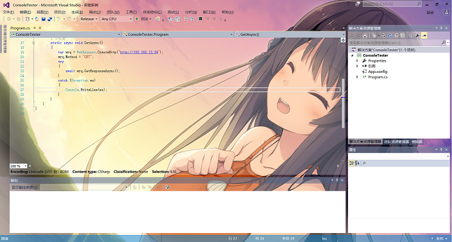
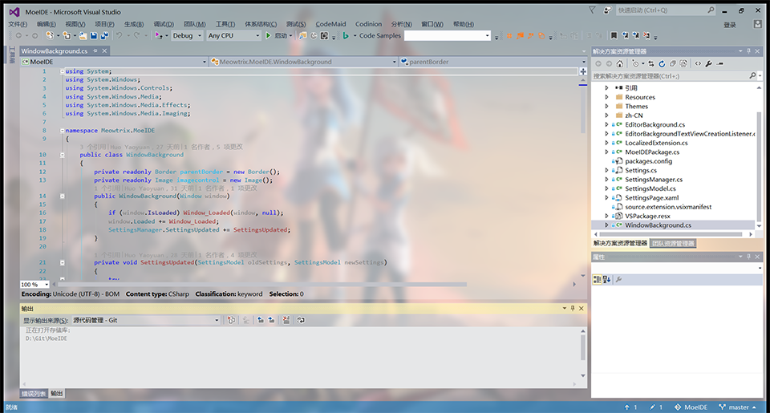

# MoeIDE

This extension allows you to pick a background image for the whole Visual Studio window.

Available on [Visual Studio Gallery](https://marketplace.visualstudio.com/items?itemName=vs-publisher-593793.MoeIDE).

Supported version: Visual Studio 2015, 2017, 2019 (or above if no breaking changes)

## Preview

## Usage

There are three color themes with transparence provided, so many parts of IDE can be transparent.

To customize the image, see Options->MoeIDE.

After installing the extension, go to Options->Environment->Color Theme, and select Light Transparent, Dark Transparent or Blue Transparent to apply the embedded theme.

*To customize colors, see [Color Theme Editor](https://marketplace.visualstudio.com/items?itemName=VisualStudioPlatformTeam.VisualStudio2017ColorThemeEditor).*

## Develop

Requires Visual Studio **2017** to build. (for the new project format)

To debug a Visual Studio Extension, use `(VisualStudioPath)\Common7\IDE\devenv.exe` and `/rootSuffix Exp` in Debug page of project properties.
